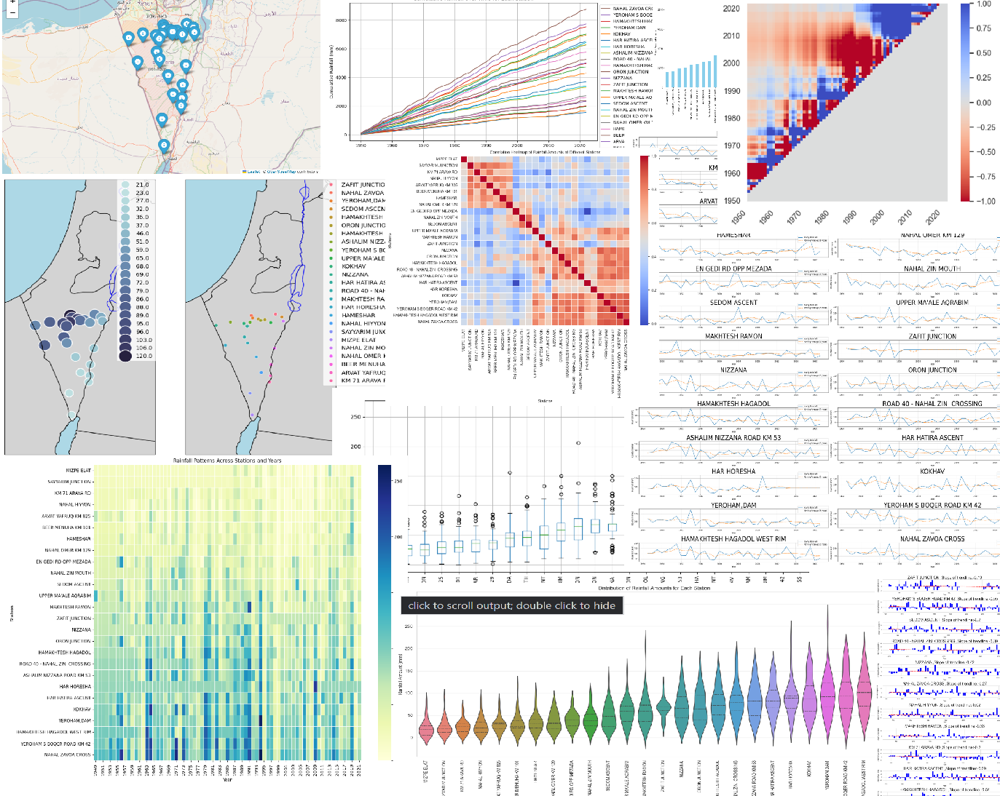
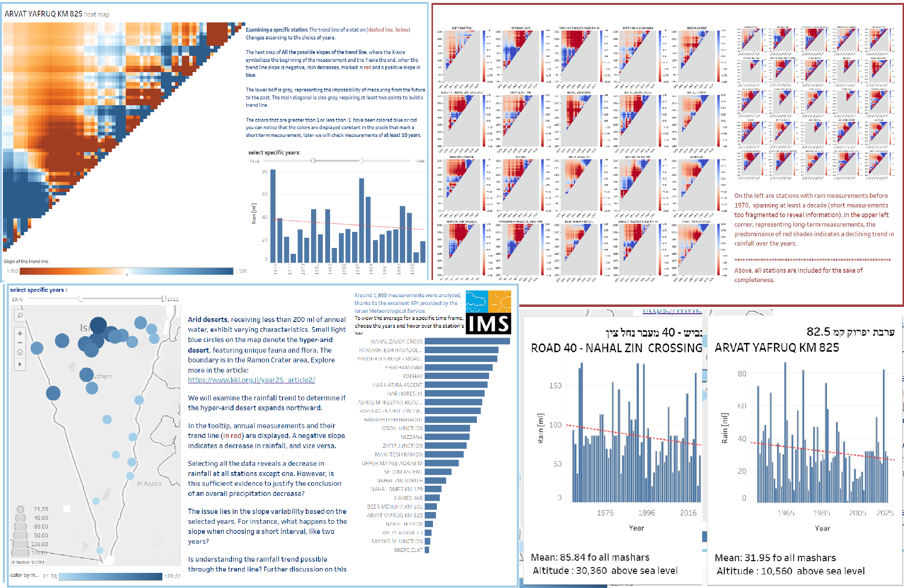

# Explore annual rainfall patterns in Southern Israel.

## Overview

Twenty-six meteorological stations in Southern Israel were assessed based on data from the [Israel Meteorological Service (IMS)](https://ims.gov.il/he/data_gov).
Analyzed with Python.

## Data and Web API

Explore the project's data and findings through the Jupyter Notebook in addition to the [Postman Web API](link) (you will need a token).

## Discussion

Analyzing rainfall data proves challenging when relying on a single trendline due to substantial correlation within the dataset. 
The data doesn't conform neatly to a linear trend, 
as illustrated in the provided It becomes evident that selecting different subsets of years for measurements can result
in trendlines with varying slopes, either positive or negative.
[Tableau visualization](https://public.tableau.com/app/profile/nisan.sher/viz/RainTrendAnalysisInSouthernIsrael/Story1). 
It becomes evident that selecting different subsets of years for measurements can result in trend lines with varying slopes,
either positive or negative.

It is implausible that the natural patterns of rainfall are influenced by the timing of our measurements. In this study, we opted to consider all possible trendlines, capturing their respective slopes in matrices. This comprehensive approach unveils a discernible decrease in rainfall amounts over time in the southern region of the State of Israel.

The matrices, graphically presented as heatmaps in the project, underscore the fluctuating slopes of the trendlines. Notably, when considering a span of 100 years, the slope of the curve line is not consistently constant. However, with a more focused timeframe, such as a minimum of 10 years, a predominant red hue emerges, especially in the upper corner. This pattern suggests a discernible decline in rainfall amounts over time.

## Libraries

1. Cartopy
2. Matplotlib
3. Seaborn
4. Pandas
5. Folium
6. NumPy
7. ListedColormap (from Matplotlib)

## Requirements

- Python 3.x

## IMG of the Tableau (power  BI of line):

 

